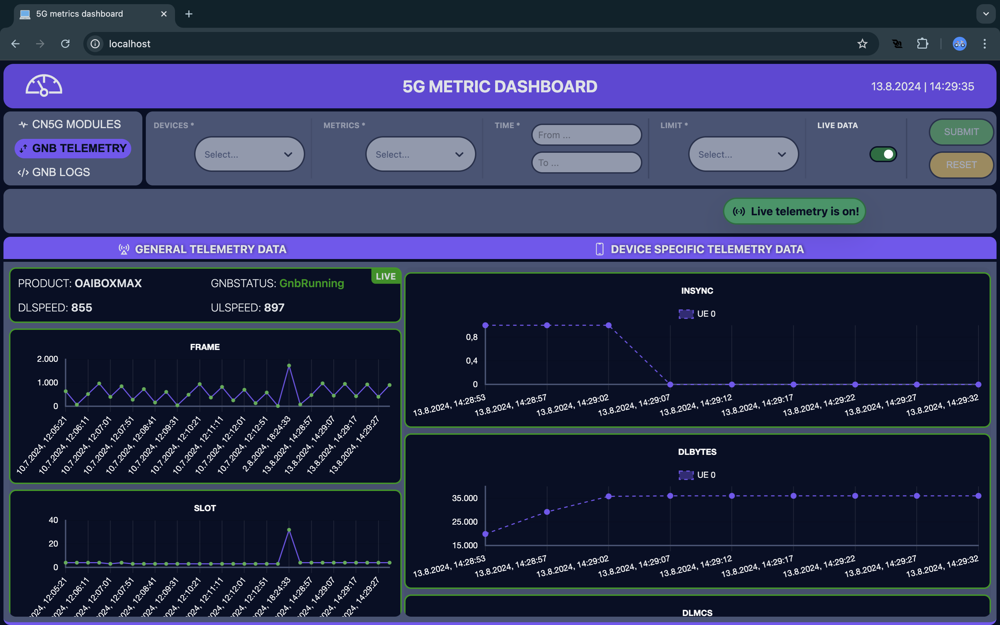
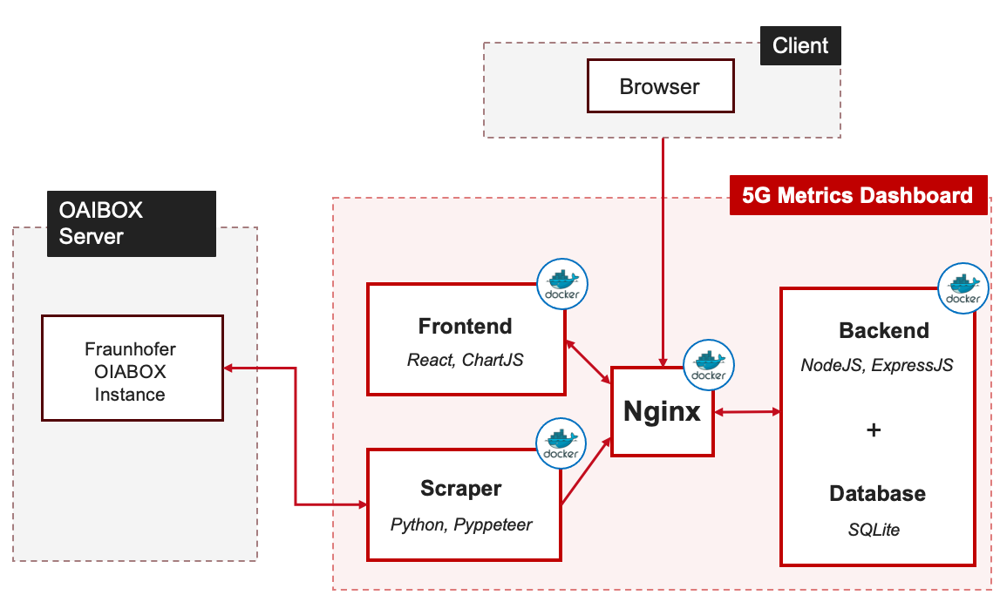

<!-- PROJECT LOGO -->
<div align="center">
  
  <h1 align="center"> Fullstack web-based 5G metrics dashboard </h1>
  <h3>Project Advanced Web Technologies (SoSe24) </h3>
</div>
<br/>

<br/>


<!-- ABOUT THE PROJECT -->
## 💡 About The Project

This project implements a web-based dashboard application designed to display both stored and live metric data from a 5G mobile network, including information from base stations (gNBs) and user devices (UEs). The system is capable of capturing and storing 5G metrics in a database, enabling users to retrieve, view, and compare data across various test sessions.

### Key Features

- **Live and Stored Data Display:** View real-time metrics as well as historical data from 5G network components.
- **Data Capture and Storage:** Efficiently capture and store 5G metrics in a database for future analysis.
- **Comparison and Analysis:** Retrieve and compare data from multiple test sessions to analyze the performance of a 5G network.
- **Scraping of WebSocket messages:** Reverse engineering and capturing of WebSocket messages from an existing [OAIBOX](https://oaibox.com/) setup to provide the necessary 5G data.

<br/>

<div align="center">
  <h3>🎥 <a href="https://drive.google.com/drive/folders/1WxvNU8Wwfcp0o9jDBbSbkER7GcXYajBT?usp=drive_link" style="color: #6a0dad; text-decoration: none;">View the demo videos of our dashboard!</a></h3>
</div>

<br/>


<!-- BUILT WITH -->
## 🛠️ Built With

* 
* 
* 
* 
* 
* 
* 
* 


<!-- SYSTEM ARCHITECTURE -->
## 🏛️ System Architecture

The architecture of our 5G metric dashboard web application is a modular, containerized system built for flexibility, scalability, and ease of maintenance. The system is composed of five key components:

- **Frontend:** The frontend service serves as the user interface, enabling users to interact with and visualize 5G data in real-time. It provides a responsive and intuitive experience, ensuring that the complex metrics are presented in a user-friendly manner.
- **Backend:** The backend service acts as the central hub for data processing. It manages the flow of information between the frontend and the database, handling requests and ensuring that data is processed accurately and efficiently.
- **Database:** The database stores both historical and live telemetry data, serving as the persistent data repository. It ensures that all 5G metric data is securely stored and can be retrieved quickly for analysis and display.
- **NGINX:** To enhance security and simplify the handling of Cross-Origin Resource Sharing (CORS) issues, the application traffic is managed by an NGINX container. NGINX serves as a reverse proxy, forwarding requests to the appropriate service.
- **Scraper:** The scraper service is responsible for collecting 5G telemetry data from external [OAIBOX](https://oaibox.com/) instances. It feeds this data into the database, ensuring that the system has up-to-date information for processing and display.

<br/>

<div align="center">
  
</div>

<br/>


<!-- GETTING STARTED -->
## 🚀 Getting Started 

To keep the deployment as simple as possible Docker Compose is used to offer an easy and fast deployment.

### Prerequisites

Before you begin, ensure that Docker and Docker Compose are installed on your machine. Familiarity with Docker is recommended.

Once the repository is downloaded, navigate to the `headless-browser/` directory. Here, you'll need to create a `.env.local` file, which will store the login credentials needed for the scraper to access the OAIBOX's websocket messages. Detailed instructions for configuring this file can be found below.

### Configure the .env.local File

In the `headless-browser/` directory of project folder create a `.env.local` file.

Your `.env.local` file should look like the template below. Be sure to replace the placeholder values with your actual credentials:

```sh
# Access link for the OAIBOX dashboard
AUTH_LINK="https://..."

# User email for the OAIBOX dashboard login
EMAIL="your-email@example.com"

# Password for the OAIBOX dashboard login
PW="your-password"
```

### Database Setup

In the `backend/` directory, a `database.db` file must be present. This file can either be pre-populated with data or be an empty file. 

- If the `database.db` file does not exist, it must be manually created.
- Ensure that the `database.db` file has the correct permissions, allowing the application to read from and write to it.


### Start The Application

Execute the following command to start the application:

   ```sh
   docker compose up -d --build
   ```

  `-d` means detached mode, so the terminal is not blocked by the running containers.
  
  `--build` means that the images are newly built before the containers are started.

### Open the UI

Once the application has started, you can access the user interface by opening a new tab in your web browser and navigating to: `http://localhost`

### Shut Down The Application

Execute the following command to stop and removes all containers:

   ```sh
   docker compose down
   ```


<!-- DOCUMENTATION -->
## 📃 Documentation & APIs

A details overview of the project and the system implementation can be found in our [project report](report/awt-pj-ss24-fullstack-web-based-5G-metrics-dashboard-2.pdf).

For an overview of the system's APIs, visit the [API Overview](https://mrettore.github.io/awt-pj-ss24-fullstack-web-based-5G-metrics-dashboard-2/). Ensure that the Docker Compose image is running before executing any API calls.


<!-- LICENSE -->
## 🧾 License

This project is licensed under the terms of the [MIT License](LICENSE).


<!-- CONTACT -->
## 📬 Contact

Ettore Marangon - ettore.carlo.marangon@campus.tu-berlin.de | [LinkedIn](www.linkedin.com/in/ettore-marangon-7ba517215)

Daniel Schrenk - d.schrenk@campus.tu-berlin.de

Moritz Schelten - m.schelten@campus.tu-berlin.de


## 🫡 Acknowledgments

* Alexander Futasz | Fraunhofer FOKUS

